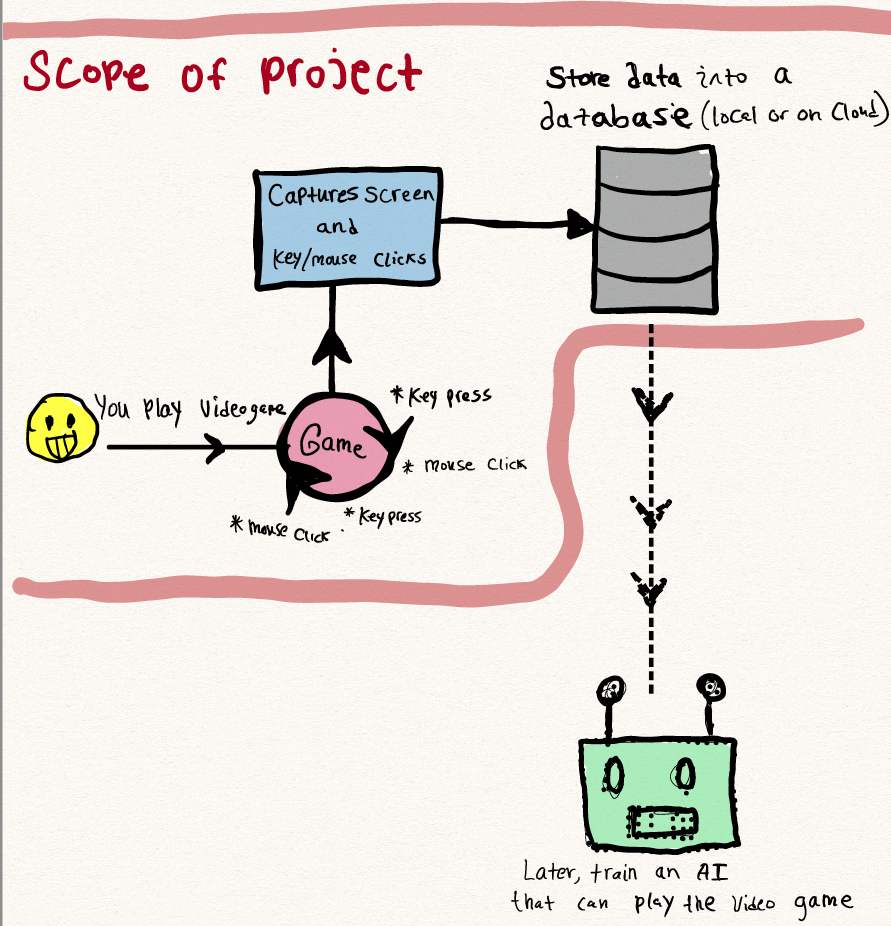

# Forward-slash 
# Forward/

## Project Abstract
A key problem in any Machine Learning project is data collection, data cleaning, and data processing. By some estimates, a Data Scientist might spend more than 80% of their time building, cleaning, and organizing their data-set. The goal of this project is to design an efficient process for data-collection in the context of training an AI to _play_ in a video-game/simulated environment. For example, creating an AI that learns to drive cars, fly planes, sword fight ... etc 

## Project Relevance
The project will heavily utilize code profiling and optimization, as there will be thousands of images being processed per minute in real-time. The more images that can be processed, the better. In addition, a type of database might be needed for storing the individual frames and the respective keys pressed at that instance of time. Finally, parallel computing might be utilized to run different aspects, and interactions with the software could be through a GUI. 

## Conceptual Design
_To build a system that captures game-screen and key/mouse presses and stores them into a Database (preferably in the Cloud)_

## Background
_This is a new project!_ 

## Required Resources
- Knowledge of Python, Java or C/C++
- Experience with GUI design
- Experience with Database design and/or Cloud will be handy
